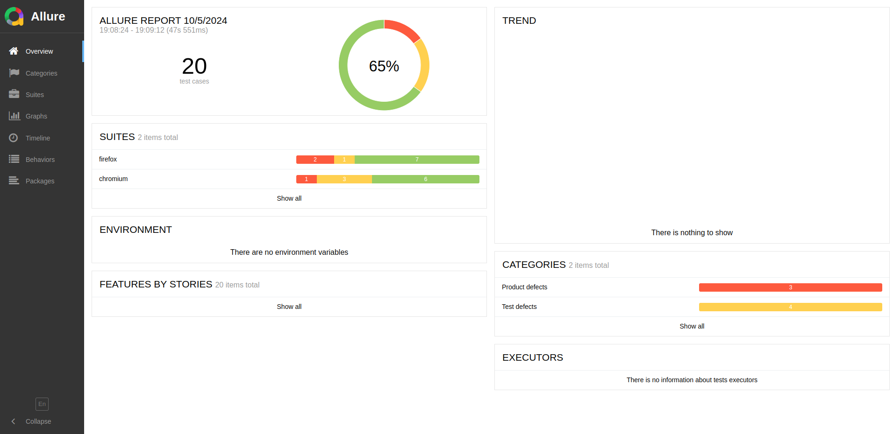

## Setup

1. Clone the repository:
   ```
   git clone https://github.com/georgerobertkplivi/hacker_news_blog.git
   cd hacker-news-blog
   ```

2. Install dependencies:
   ```
   npm install
   ```

3. Install Playwright browsers:
   ```
   npx playwright install
   ```

4. Install system dependencies for WebKit (Ubuntu/Debian):
   ```
   sudo apt-get update
   sudo apt-get install libicu-dev libwebp-dev libpcre3-dev libffi-dev
   ```
   For other operating systems, please refer to the [Playwright documentation](https://playwright.dev/docs/troubleshooting).

## Running Tests and Generating Reports

1. Make sure the `run_report.sh` script is executable:
   ```
   chmod +x run_report.sh
   ```

2. Run the tests and generate the Allure report:
   ```
   ./run_report.sh
   ```

   This script will:
   - Run the Playwright tests
   - Generate the Allure report
   - Open the Allure report in your default browser

## Manual Steps

If you prefer to run the steps manually:

1. Run the tests:
   ```
   npm run test
   ```

2. Generate the Allure report:
   ```
   npm run allure:generate
   ```

3. Open the Allure report:
   ```
   npm run allure:open
   ```

## Troubleshooting

- If you encounter issues with missing libraries for WebKit, make sure you've installed the system dependencies mentioned in the Setup section.
- If the Allure report doesn't open automatically, you can find the HTML report in the `allure-report` directory and open `index.html` manually in your browser.


## Run tests with Allure



